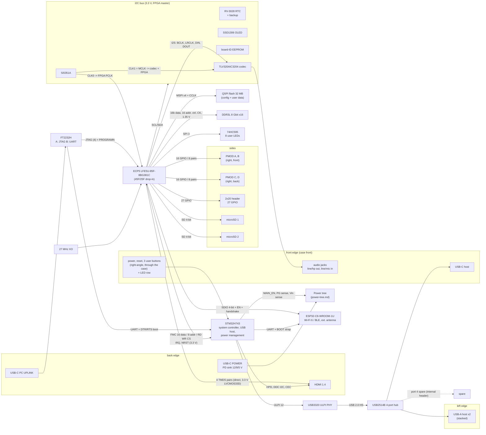

# System block diagram

Session 3 deliverable. Every chip, every bus between chips, and who owns what. Pin-level detail for the FPGA is in `pinmap.csv`; for the STM32 in `stm32-pin-plan.md`. Board orientation: front edge = HDMI / USB host / audio, back edge = power USB-C and PC-uplink USB-C, PMODs on the sides (`decisions.md` D3, D24).

## Chips and ownership

| Block | Part (BOM session may substitute) | Owner / bus master | Notes |
|---|---|---|---|
| FPGA | LFE5U-85F-8BG381C, caBGA381 | — | 45F/25F drop-in; -8 grade (D16) |
| Configuration flash | 32 MB (256 Mbit) QSPI NOR, 3.3 V | FPGA (Master SPI x4 boot) | Programmed over JTAG (openFPGALoader through the FT2232H) or by the FPGA design via USRMCLK |
| SDRAM | DDR3L 8 Gbit x16, FBGA-96 | FPGA (LiteDRAM) | Single rank; 2nd-rank pins reserved (D22) |
| Video | HDMI 1.4 connector, direct TMDS | FPGA | 720p60 / 1080p30 target (D17); HPD/DDC/CEC on the STM32 |
| Storage | 2x microSD, 4-bit SD mode | FPGA | No card-detect (D20) |
| Expansion | 4x PMOD, 2x20 header | FPGA | 3.3 V; all PMOD pins on pad pairs |
| User LEDs | 74HC595 + 8 LEDs | FPGA (3-wire SPI) | D18 |
| System controller | STM32H743 (LQFP144 proposed) | — | FMC slave port on the FPGA side; power management; USB host; HDMI aux signals; buttons |
| USB host | USB3320 ULPI PHY + USB2514B hub | STM32 OTG_HS | 3 external downstream ports (2x A, 1x C) + 1 spare |
| PC uplink | FT2232H | PC | Channel A = FPGA JTAG (MPSSE); channel B = UART to the STM32, DTR/RTS drive BOOT0/NRST for the ROM bootloader (D28) |
| Wi-Fi / BLE | ESP32-C6-WROOM-1U | FPGA data path (SDIO slave), STM32 control (UART, BOOT) | EN driven by the FPGA (`esp_en`) |
| Audio | TLV320AIC3204 codec, jacks | FPGA (I2S), FPGA (I2C control) | Codec runs from 3.3 V with its internal LDOs enabled |
| Clocks | 27 MHz XO, Si5351A (25 MHz crystal) | FPGA (I2C control of Si5351A) | see clock tree |
| Housekeeping | RV-3028 RTC, SSD1306 OLED, board-ID EEPROM | FPGA I2C | RTC on the standby rail with backup |
| Power | USB-C PD sink + bucks/LDOs | STM32 (enable/sequencing, soft power) | `power-tree.md` |

## Buses between chips

| Bus | From → to | Signals | Rate / standard | Voltage | Session reference |
|---|---|---|---|---|---|
| DDR3L | FPGA banks 2/3 ↔ DRAM | DQ[15:0], DQS[1:0]±, DM[1:0], A[15:0], BA[2:0], RAS/CAS/WE, CS, CKE, ODT, CK±, RESET | 800 MT/s max (-8), SSTL135 | 1.35 V | pinmap `ddr3_*` |
| TMDS | FPGA bank 7 → HDMI | 4 pairs | 742.5 Mb/s at 720p60 | 3.3 V LVCMOS33D + series R | pinmap `hdmi_*` |
| FMC | STM32 ↔ FPGA bank 1 | D[15:0], A[7:0], NOE, NWE, NE, IRQ, NRST | async, ~50 ns cycles | 3.3 V | pinmap `fmc_*` |
| SD ×2 | FPGA bank 0 → sockets | CLK, CMD, D[3:0] | ≤ 50 MHz | 3.3 V | `sd1_*`, `sd2_*` |
| SDIO | FPGA bank 0 ↔ ESP32-C6 | CLK, CMD, D[3:0], EN, handshake | ≤ 40 MHz | 3.3 V | `esp_*` |
| ESP control | STM32 ↔ ESP32-C6 | UART TX/RX, BOOT | 3.3 V | | `stm32-pin-plan.md` |
| I2C | FPGA bank 0 ↔ 5 slaves | SCL, SDA | 400 kHz | 3.3 V | `i2c_*` |
| I2S | FPGA bank 7 ↔ codec | BCLK, LRCLK, DIN, DOUT (+ MCLK from Si5351A) | 48/96 kHz frames | 3.3 V | `i2s_*` |
| MSPI | FPGA bank 8 ↔ flash | IO[3:0], CS, CCLK | ≤ 62 MHz | 3.3 V | `flash_*` |
| LED SR | FPGA bank 8 → 74HC595 | SCLK, MOSI, LATCH | slow | 3.3 V | `led_sr_*` |
| JTAG | FT2232H A → FPGA | TCK, TMS, TDI, TDO (+ PROGRAMN, DONE, INITN sensing) | ≤ 30 MHz | 3.3 V (VCCIO8) | dedicated pins |
| UART | FT2232H B ↔ STM32 | TXD, RXD, DTR→BOOT0, RTS→NRST | 3.3 V | | D28 |
| ULPI | STM32 ↔ USB3320 | DATA[7:0], CLK 60 MHz, DIR, NXT, STP, RESET | 60 MHz | 3.3 V (1.8 V internal) | STM32 |
| USB HS | USB3320 → USB2514B upstream; hub → ports | D+/D− | 480 Mb/s | | STM32 |
| HDMI aux | STM32 ↔ HDMI | HPD (5 V in), DDC SCL/SDA (5 V, level shifted), CEC | | | `stm32-pin-plan.md` |
| Power control | STM32 ↔ power tree | MAIN_EN, PG_3V3, PG_1V35, PG_1V1, VIN_SENSE (ADC), PWR_BTN (WKUP) | | 3.3 V standby | `power-tree.md` |

## Clock tree

| Source | Frequency | Consumers | Notes |
|---|---|---|---|
| 27 MHz XO (3.3 V, ±25 ppm) | 27 MHz | FPGA F2 (PCLKT7_0) → system PLL, HDMI PLL (27 MHz × 27.5 = 742.5 MHz serial for 720p60 via PLL + ECLK), DDR3 PLL | HDMI-friendly base; any PLL reachable (D7) |
| Si5351A, 25 MHz crystal | CLK0 programmable → FPGA G3 (PCLKT7_1); CLK1 = 12.288 / 24.576 MHz MCLK → codec + FPGA H5; CLK2 spare | audio, experiments | Set over I2C by the FPGA; CLK2 could go to the 2x20 header later |
| STM32 HSE | 25 MHz crystal | STM32 core PLL, USB | ULPI clock (60 MHz) comes from the PHY |
| USB3320 | 24 MHz crystal | PHY | provides 60 MHz ULPI clock to the STM32 |
| USB2514B | 24 MHz crystal | hub | |
| ESP32-C6 module | internal 40 MHz | module | |
| RV-3028 | internal 32.768 kHz | RTC | not on the FPGA (spec) |

## Reset, configuration and boot sequence

1. Standby: 5V_SYS and 3V3_STBY are up; STM32 in Standby, RTC running, power button on a WKUP pin.
2. Power on: STM32 asserts MAIN_EN → rails come up in the sequence in `power-tree.md`; STM32 waits for PG_1V1.
3. FPGA POR releases when VCC, VCCAUX and VCCIO8 are valid (datasheet 2.14.2); the FPGA boots from the QSPI flash in Master SPI mode (CFG[2:0] = 010). DONE and INITN LEDs show progress; the STM32 also reads DONE and can pulse PROGRAMN (open-drain) to reconfigure.
4. STM32 holds `fmc_nrst` low until DONE is high, then releases it; the FPGA design starts.
5. The FPGA design enables the ESP32 (`esp_en`), initialises the Si5351A/codec/OLED over I2C, and brings up DDR3 (LiteDRAM calibration).
6. The STM32 enumerates USB devices on the hub. Firmware update paths: STM32 via the FT2232H channel B (ROM bootloader, DTR/RTS) or USB DFU on a hub port is not available (host side), so keep the UART path; ESP32 via STM32 UART pass-through; FPGA flash via JTAG.

## Decisions taken in this session

See `decisions.md` D28–D31 (USB uplink topology, power input, rail architecture and sequencing, standby domain).
